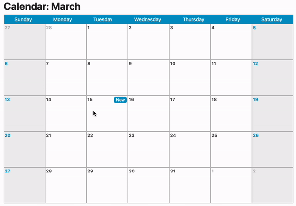

# React Reminders

## Usage example

## How to deploy

- Run `npm install` to install all dependencies.
- Run `npm start` to run the app locally.
- You can find the project running on `localhost:3000`.

## Features

- Add the capacity of creating reminders for a specific day.
- Add the capacity of choosing the time and the location of the reminder.
- Get the weather of the location on a specific day. [MetaWeather](https://www.metaweather.com/).
- Sort the reminders by time automatically.
- Delete the reminder.
- Drag and drop the reminder to change the day.
- Multiple reminders in a day? Scroll the day-box to see all the reminders.
